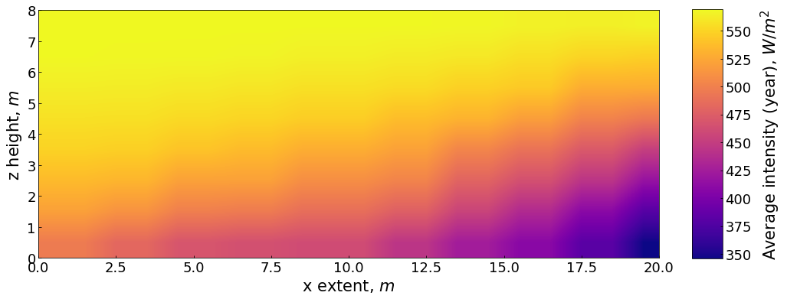
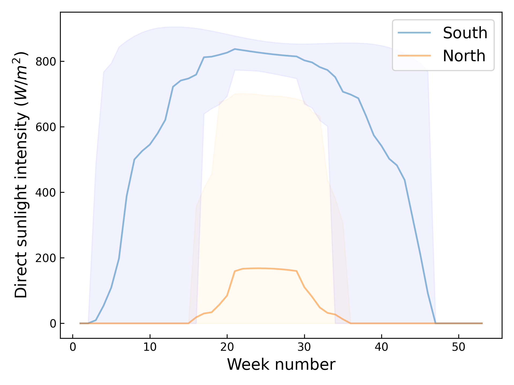

<p align="center">
  
</p>

Limão calculates projected direct sunlight intensities over time for arbitrary building elevations. See how direct sunlight varies throughout the year for windows at different orientations, and heights above ground level, or compare sunlight intensities for different locations.

Primarily this depends on the the building orientation, the latitude, and the time of the year, but also on occluding obstacles. Limão incorporates time and location dependent sunlight intensity projections, with digital surface and terrain maps, to determine an estimated overall intensity as a function of time.


# Applications

For illumination of a wall (for example, for photovoltaic panel placement), Limão provides predicted sunlight intensities on a user-defined vertical plane in real space:

<p align="center">
  
</p>

Here the intensities are averaged over the year, and the variation is mostly due to occluding buildings. The intensities over time for a single point `(lat, lon, height)` can also be queried:

<p align="center">
  
</p>

This is useful for comparing the intensity from different directions, and the produced plots indicate the maximum and minimum intensity during daylight hours.

# Installation

Either from the PyPI release

```bash
pip install limao
```

or the bleeding edge via GitHub

```bash
git clone git@github.com:dpohanlon/limao.git
cd limao
pip install .
```

# Usage

Limão requires digital surface models (DSM) and digital terrain models (DTM) for the region of interest, in addition to the latitude and longitude. For the UK these are available from [DEFRA](https://www.data.gov.uk/dataset/f0db0249-f17b-4036-9e65-309148c97ce4/national-lidar-programme) ([direct link](https://environment.data.gov.uk/DefraDataDownload/?Mode=survey)), and are derived from satellite LIDAR measurements. Latitude and longitude can be obtained from Google Maps, and must correspond to a point on the DSM and DTMs.

**Currently this assumes UK DSM/DTMs, as the lat/lon is converted into UK Ordnance Survey map coordinates.**

Limão ships with a standalone executable and as a library - here we'll just use the command line interface. All use cases require the latitude, longitude, a DSM, and a DTM:

```bash
limao --lat 52.198 --lon 0.135 -s TL45ne_LZ_DSM_2m.tif -t TL45ne_DTM_2m.tif
```

By default this will just produce the intensity from the north and south on the point defined by the latitude and longitude coordinates. To produce the 2D projection, additionally pass the `--proj` argument, with optional horizontal and vertical extent of the surface in metres:

```bash
--proj --horizontal 20 --vertical 8
```
